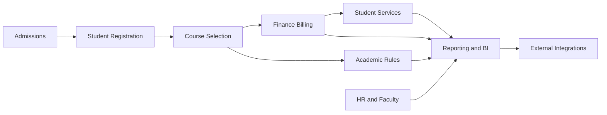
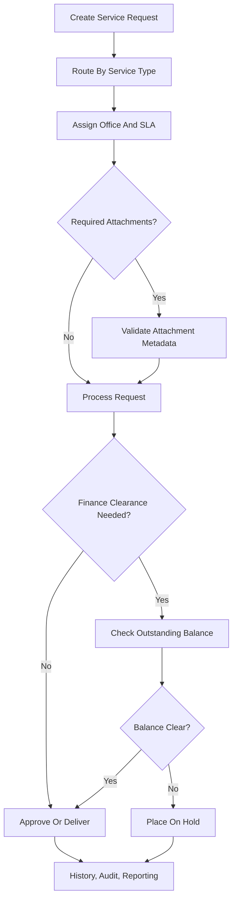

# University ERP Demonstration Architecture Document

## 1. Executive Summary

This document describes the transformation of the existing EduSys application into a university-oriented ERP/SIS demonstration system. The project follows the enterprise architecture direction from the referenced university ERP paper and uses the TOGAF ADM method as the architecture planning and migration framework.

The implementation is designed for a university enterprise architecture class. It is not presented as a complete commercial ERP product. Instead, it demonstrates how university ERP capabilities can be planned, governed, implemented, integrated, and migrated through a staged enterprise architecture approach.

The resulting system is a modular monolith built with:

- React frontend role portals.
- Spring Boot REST backend.
- PostgreSQL-style persistence managed through Flyway migrations.
- Role-based access control.
- Audit logging.
- Working cross-module data exchange.
- Simulated and HTTP-ready integration adapters for external systems.

The system now demonstrates the core ERP flow:

## 2. Project Context

The original system was closer to a school management system. For the university ERP demonstration, visible middle-school-oriented modules were renamed, suspended, or repositioned so the system could represent a university SIS/ERP environment.

The objective was not to rebuild the whole product from scratch. The architecture decision was to evolve the existing system by adding university-specific modules and workflows while reusing existing user, course, finance, authentication, and frontend infrastructure.

This matches a realistic enterprise architecture scenario: an institution often cannot replace every system at once, so the architecture must plan controlled migration increments.

## 3. Architecture Method: TOGAF ADM

TOGAF ADM is used as the enterprise architecture method. Agile is useful as a delivery method, but in this project TOGAF ADM is the enterprise architecture framework. Agile-style incremental implementation can support TOGAF execution, but it does not replace the enterprise architecture method.

The project maps to TOGAF ADM as follows:

| TOGAF ADM phase | Application in this ERP project |
|---|---|
| Preliminary Phase | Establish university ERP scope, choose modular monolith, define governance principles. |
| Phase A: Architecture Vision | Define target university SIS/ERP capabilities and paper-aligned modules. |
| Phase B: Business Architecture | Model university business processes such as admissions, registration, course selection, services, HR, finance, and reporting. |
| Phase C: Information Systems Architecture | Define application modules, data entities, APIs, workflows, and integration records. |
| Phase D: Technology Architecture | Use React, Spring Boot, PostgreSQL/Flyway, REST APIs, JWT security, and deployment environment configuration. |
| Phase E: Opportunities and Solutions | Identify incremental slices that turn demo surfaces into working modules. |
| Phase F: Migration Planning | Sequence implementation phases from repositioning to working modules, governance, reporting, and integrations. |
| Phase G: Implementation Governance | Track verification with backend tests, frontend builds, audit logs, and role checks. |
| Phase H: Architecture Change Management | Maintain a gap register for production items such as real vendor onboarding and richer analytics. |

## 4. Architecture Principles

The ERP demonstration is guided by these principles:

- **University-first scope:** visible workflows should represent university operations, not middle-school operations.
- **Incremental migration:** reuse working infrastructure and add university ERP modules in controlled slices.
- **Modular monolith first:** keep deployment simple for a class/demo while separating modules logically in backend packages and frontend pages.
- **Working data exchange:** modules should not be static mock screens; they should create, read, update, and exchange persistent data.
- **Governed integration:** external systems should be represented through auditable integration runs, connection configuration, retry/failure handling, and secret references.
- **Security and auditability:** role checks and ERP event logs should support governance expectations.

## 5. Software Architecture Decision

The chosen software architecture is a **modular monolith**.

This means the system remains one deployable backend and one frontend application, but the ERP capabilities are organized as separate logical modules:

- Admissions
- Student registration
- Course selection
- Academic rules
- Finance
- Student services
- HR/faculty
- Reporting and BI
- Integration management
- User/access management

This is appropriate for the class demonstration because:

- It is easier to run and explain than microservices.
- The existing system is already a Spring Boot and React application.
- The ERP modules still exchange data through clear service and API boundaries.
- Future migration to services remains possible if scale or organizational needs justify it.

## 6. Paper-Aligned ERP Modules

The referenced paper expects a university ERP/SIS to cover administrative, academic, financial, reporting, and integration concerns. The implemented system maps to those expectations as follows:

| Paper-aligned module | Implemented capability |
|---|---|
| Admissions | Applicant intake, screening, acceptance/rejection, conversion into student users. |
| Student registration | Student records are created from accepted applicants and linked to course/service/finance workflows. |
| Academic management | University courses, teaching assignments, faculty workload, academic records. |
| Course selection | Student course selections, credit limits, finance holds, prerequisites, prerequisite groups, co-requisites, repeat rules. |
| Learning progress and assessment | Existing academic records and grades are reused for progress checks and degree audit. |
| Finance | Tuition invoice generation from selected credits, payments, balances, bank callback simulation. |
| Student services | Configurable service types, requests, comments, attachments, queues, SLA, advising, program change, graduation clearance. |
| HR/faculty information | Faculty profiles, departments, term workload, leave workflow. |
| Reporting and analytics | KPI summaries, BI breakdowns, report definitions, report runs, CSV export, drill-down rows. |
| User/access management | Login, role flags, admin/staff permissions, protected APIs, audit logs. |
| External integrations | LMS roster export, bank payment callback, notifications, government report export, HTTP adapter configuration. |

## 7. Suspended Or Repositioned Original Modules

Some original school-oriented features were removed from the visible university ERP scope or treated as out of scope:

- Parent portal as a primary university module.
- Parent-student link management.
- Cafeteria/lunch operations.
- Middle-school nurse, bus, homeroom, and behavior workflows.

This is important architecturally because enterprise architecture includes scope control. Not every existing application capability belongs in the target university ERP.

## 8. Business Architecture

### 8.1 Core University Process Flow

The central business process is:

1. Applicant applies through Admissions.
2. Admissions screens and accepts the applicant.
3. Accepted applicant becomes a student user.
4. Student selects courses.
5. Course selection checks academic and finance rules.
6. Finance creates tuition invoices from selected credits.
7. Student services can process official requests.
8. Reporting and BI summarize operational data.
9. Integrations exchange data with LMS, bank/payment, notification, and government systems.

### 8.2 Student Services Process

### 8.3 Course Selection Process

Course selection is governed by:

- Maximum/minimum credit policy.
- Finance holds.
- Prerequisite rules.
- Prerequisite groups.
- Co-requisite rules.
- Repeat-course policy.
- Academic standing/probation settings.
- Completed academic records.

This demonstrates business rule centralization instead of hardcoding every academic policy into a screen.

## 9. Data Architecture

The system uses persistent tables for university-specific ERP data. These are managed through Flyway migrations.

Major university data areas include:

- Applicants.
- Course selections.
- Academic records.
- Academic policies.
- Program requirements.
- Service types.
- Service requests.
- Request comments, history, and attachment metadata.
- Departments.
- Faculty HR profiles.
- Faculty workload records.
- Faculty leave requests.
- ERP event logs.
- Integration connections.
- Integration runs.
- Report definitions.
- Report runs.

The data architecture supports the enterprise goal that modules exchange actual data rather than only displaying static pages.

## 10. Application Architecture

### 10.1 Backend

The backend is a Spring Boot REST API. University ERP capabilities are implemented under the university backend package and exposed through protected REST endpoints.

Backend responsibilities:

- Validate requests.
- Enforce role checks.
- Persist ERP records.
- Calculate eligibility and reporting summaries.
- Record audit events.
- Execute internal and external integration flows.

### 10.2 Frontend

The frontend is a React application with admin and role-based portals. University ERP pages expose working workflows for:

- Blueprint/demo overview.
- Admissions.
- Course selection.
- Student services.
- Reporting and BI.
- HR/faculty.
- Integration configuration and run history.

Frontend content uses translation keys where visible labels were added.

### 10.3 Integration Layer

The integration layer includes:

- Connection records for LMS, bank, notification, and government reporting.
- Adapter mode: `MOCK` or `HTTP`.
- Auth type: `NONE`, `API_KEY`, `BEARER_TOKEN`, or `BASIC`.
- Secret references instead of direct secret storage.
- Persisted run history.
- Failure simulation.
- Retry records.
- Smoke-test API.
- Vendor onboarding environment template and script.

## 11. Technology Architecture

| Layer | Technology |
|---|---|
| Frontend | React, Vite |
| Backend | Spring Boot |
| API style | REST |
| Database | PostgreSQL-compatible schema with Flyway migrations |
| Authentication | JWT-based login |
| Authorization | Role-based Spring Security checks |
| Reporting exports | CSV endpoints |
| Integration transport | Mock adapter and HTTP POST adapter |
| Deployment support | EC2 backend deployment files and environment templates |

## 12. Implementation Phases

### Phase 1: University Repositioning And Minimal ERP Exchange

Implemented:

- Renamed/suspended middle-school-facing concepts.
- Added university ERP demo pages.
- Implemented Admissions -> Student Registration -> Course Selection -> Finance -> Reporting exchange.
- Added repeatable demo seed action.

### Phase 2: Expanded Working Modules

Implemented:

- Student service request workflow.
- Configurable service types.
- Finance holds.
- Prerequisites and academic records.
- Academic policy engine.
- Graduation progress checks.
- Degree audit.
- Advising and program-change shortcuts.
- Graduation clearance workflow.

### Phase 3: Governance And Integration

Implemented:

- University ERP event logs.
- Integration status and run history.
- LMS roster export.
- Bank payment callback.
- Notification dispatch records.
- Government report export.
- Integration connection configuration.
- Retry/failure handling.
- HTTP adapter and secret resolver.
- Vendor onboarding package.

### Productionization Slices

Additional slices completed:

- HR/faculty profiles.
- Departments and term workload.
- Faculty leave requests.
- Reporting BI breakdowns.
- Persistent report definitions and runs.
- CSV exports and report filters.
- Drill-down report rows.
- Role visibility metadata.
- External adapter configuration.
- Production integration hardening.

## 13. Cross-Module Data Exchange

The system demonstrates ERP behavior through data movement between modules:

| Source module | Target module | Exchange |
|---|---|---|
| Admissions | Student Registration | Accepted applicant becomes a student user. |
| Course Selection | Finance | Selected credits can generate tuition invoices. |
| Finance | Course Selection | Outstanding balances can block additional course selections. |
| Student Services | Finance | Official requests can require finance clearance. |
| Academic Records | Course Selection | Completed courses satisfy prerequisites. |
| Academic Records | Graduation Audit | Completed credits and required courses determine graduation readiness. |
| HR/Faculty | Reporting | Faculty profiles and workload feed reports. |
| Integrations | Reporting | Integration runs feed integration health and audit history. |
| All high-impact modules | Audit | Actions create university ERP event logs. |

## 14. Reporting And Analytics

The reporting module is more than a simple dashboard. It includes:

- Live KPI summaries.
- Admissions pipeline counts.
- Student service status and SLA summaries.
- Finance invoice status and billed totals.
- Academic policy and requirement counters.
- Program requirement totals.
- Faculty workload reporting.
- Integration health reporting.
- Persistent report definitions.
- Generated report snapshots.
- Report run history.
- CSV export.
- Drill-down detail rows.
- Role visibility metadata.

This supports the paper's expectation that ERP improves visibility and decision-making across the university.

## 15. Governance, Security, And Audit

Governance is represented through:

- Role-protected backend APIs.
- Admin-only integration configuration and smoke tests.
- ERP event logs for important actions.
- Persistent report runs.
- Persistent integration runs.
- Retry/failure status for integrations.
- Secret references instead of direct secret exposure.

This allows the demo to show not only operational workflows but also enterprise governance.

## 16. External Integration Strategy

The system supports two integration modes:

### Mock Mode

Mock mode is appropriate for classroom demonstration. It allows the ERP to show integration behavior without requiring real bank, LMS, government, or SMS/email vendor accounts.

### HTTP Mode

HTTP mode is the production-ready adapter path. It can POST generated ERP payloads to configured endpoints and supports:

- API key authentication.
- Bearer token authentication.
- Basic authentication.
- Environment/property-based secret references.
- Smoke-test validation.
- Persisted success/failure run history.

For example, a real Mongolian bank integration such as Khan Bank, QPay, or another payment gateway would be treated as an institution onboarding task. The ERP code path is ready, but the real endpoint contract and credentials must come from the bank or payment provider.

## 17. Vendor Onboarding Package

The deployment package includes:

- `deploy/ec2/backend/vendor-integrations.env.example`
- `deploy/ec2/backend/smoke-test-university-integrations.ps1`
- `deploy/ec2/backend/UNIVERSITY_ERP_VENDOR_ONBOARDING.md`

These files allow operators to:

1. Enter real vendor sandbox URLs.
2. Store secrets in the deployment environment.
3. Configure ERP integration connections through the admin API.
4. Run smoke tests.
5. Review integration run history.

## 18. TOGAF Deliverables Represented

| TOGAF deliverable | Project artifact |
|---|---|
| Architecture Vision | University ERP repositioning and target module list. |
| Business Architecture | Admissions, registration, course selection, service, finance, HR workflows. |
| Data Architecture | Flyway migrations and persistent university ERP entities. |
| Application Architecture | React pages, Spring Boot services/controllers, module APIs. |
| Technology Architecture | Spring Boot, React, PostgreSQL, REST, JWT, deployment env templates. |
| Opportunities and Solutions | Productionization plans A-D and implementation slices. |
| Migration Plan | Phases 1-3 and production execution progress. |
| Implementation Governance | Test/build verification, audit logs, role checks, task tracker. |
| Architecture Change Management | Gap register and optional institution onboarding items. |

## 19. Demonstration Script

The following script can be used during presentation:

1. Open the University ERP blueprint page.
2. Explain that the system uses TOGAF ADM and a modular monolith.
3. Run or describe the demo seed action if available.
4. Create or review an applicant in Admissions.
5. Accept the applicant and show student registration.
6. Select courses for the student.
7. Show academic eligibility rules such as prerequisites, co-requisites, and credit limits.
8. Generate or review finance invoice behavior.
9. Create a student service request such as transcript, advising, program change, or graduation clearance.
10. Show service request history, queue/SLA, attachments/comments, and finance clearance behavior.
11. Open HR/faculty and show profiles, departments, workload, and leave requests.
12. Open Reporting and show KPIs, report definitions, CSV export, drill-down rows, and run history.
13. Open integration readiness and show LMS, bank, notification, and government exchange records.
14. Explain that bank integration can be mocked for the class and later replaced by a real provider such as Khan Bank or QPay through HTTP adapter configuration.
15. Conclude by showing the gap register and explaining remaining production onboarding work.

## 20. Current Completion Status

For the class/demo scope, the ERP implementation is complete.

Implemented and working:

- University terminology and scoped navigation.
- Admissions workflow.
- Student registration through applicant conversion.
- Course selection with academic and finance checks.
- Academic policy engine.
- Prerequisite groups and co-requisites.
- Program requirements and degree audit.
- Graduation clearance.
- Student services with configurable types, history, comments, attachments, SLA, queues, and assignments.
- Finance invoices/payments and bank payment callback simulation.
- HR/faculty profiles, departments, workload, and leave workflow.
- Reporting and BI with snapshots, CSV, filters, drill-down, and visibility metadata.
- Integration run persistence.
- LMS roster export.
- Notification dispatch.
- Government report export.
- HTTP adapter mode, secret references, smoke tests, and vendor onboarding package.
- Audit/event logging for governance.

Remaining production-only work:

- Real vendor contracts and credentials.
- Real institution deployment environment.
- Live vendor smoke tests.
- Richer long-term analytics/warehouse-style reporting.
- More advanced document validation and academic standing rules.

## 21. Conclusion

The EduSys university ERP demonstration now shows how an existing education system can be repositioned and extended using TOGAF ADM. The project demonstrates architecture vision, business process redesign, data and application architecture, integration planning, migration sequencing, governance, and change management.

The most important outcome is that the ERP is not only a set of screens. It has persistent data, REST APIs, cross-module workflows, reporting, auditability, and integration readiness. That makes it suitable as a university enterprise architecture demonstration while still being honest about what would require real institutional production onboarding.
